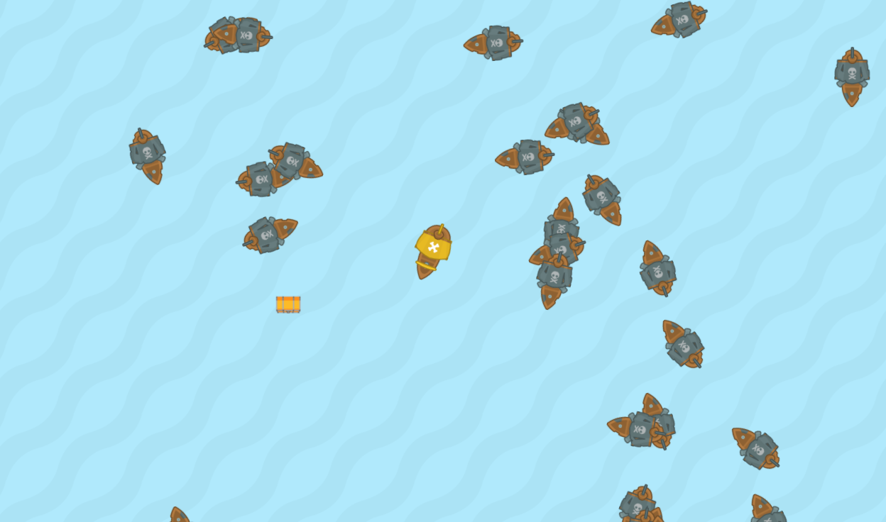

# CMTPRG01-8 - Toets Treasure Hunt - Opdracht A

## Spelregels

In het spel Treasure Hunt ga je met jouw gele schip op zoek naar een schat. Maar pas op, op zee vaart ook een piratenschip. Als het piratenschip met jou in aanraking komt is het game over. 
Lukt het je om een schat op te pakken dan krijgen alle piraten daar bericht van en zullen je achterna komen. Ook zullen er meer piraten op zee verschijnen.

Als je de schat oppakt gebeuren er een aantal dingen: 
- de schat krijgt willekeurig een nieuwe plek op het scherm
- alle piratenboten die dan op zee zijn, varen naar de plek waar de schat lag.
- er komt een nieuw piratenschip op zee bij.  

### Piratenschip
- het standaard gedrag van een een piratenschip is dat deze een willekeurige kant op vaart. Na 60 frames wordt dit willekeurig een andere kant. Zie [Tips](#tips) voor hulp bij dit onderdeel. 
- als de speler een schatkist oppakt gaat een piratenboot 'jagen'. Deze zal dan naar de plek waar de schat lag varen. Hulp hierbij vind je ook in de [Tips](#tips)
- Na enige tijd (2 seconden) zal het piratenschip niet meer gaan jagen, maar terugkeren naar zijn standaard gedrag. 

### Spelerschip
- Het spelerschip wordt bestuurd met de pijltjestoetsen. 'Left' en 'Right' om te draaien. 'Up' om te accelereren.

## Checklist voor uploaden
- Let op de deadline
- Uploaden op [Cumlaude](https://lms.hr.nl)
- Plaat de foto van het klassendiagram in de hoofdmap
- Vul het verantwoordingsdocument volledig in volgens de eisen van de beoordelingscriteria
- Maak een zip-bestand van de hoofdmap. Zet in de bestandsnaam van de zip je naam